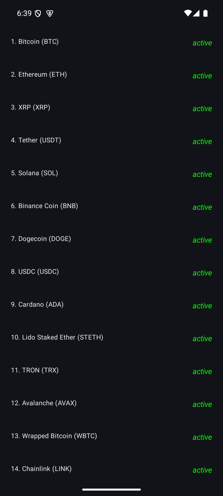

# Android-Clean-Architecture-MVVM-Compose-Hilt
A clean architecture approach  using Jetpack compose, Kotlin, Navigation, MVVM, Hilt, Kotlin Coroutines, Flow and Retrofit.

## 🖼️ OutPut Screens

| List Screen   | Details Screen  | 
|---------------|-----------------|
|  |  |
